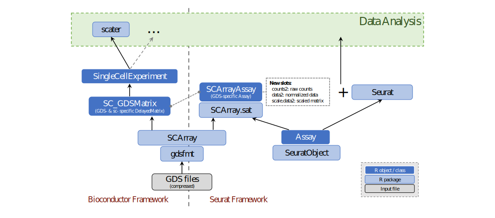

Large-scale single-cell RNA-seq data analysis using GDS files and Seurat
====


[GNU General Public License, GPLv3](http://www.gnu.org/copyleft/gpl.html)


## Features

The package extends the [Seurat](https://cran.r-project.org/web/packages/Seurat/index.html) classes and functions to support Genomic Data Structure ([GDS](http://www.bioconductor.org/packages/gdsfmt)) files as a DelayedArray backend for data representation. It relies on the implementation of GDS-based DelayedMatrix in the [SCArray](http://www.bioconductor.org/packages/SCArray) package to represent single cell RNA-seq data. The common optimized algorithms leveraging GDS-based and single cell-specific DelayedMatrix (SC_GDSMatrix) are implemented in the SCArray package. This package introduces a new SCArrayAssay class (derived from the Seurat Assay), which wraps raw counts, normalized expressions and scaled data matrix based on GDS-specific DelayedMatrix. It is designed to integrate seamlessly with the Seurat package to provide common data analysis in the SeuratObject-based workflow. Compared with Seurat, SCArray.sat significantly reduces the memory usage and can be applied to very large datasets.




## Bioconductor

v0.99.0

Package News: [NEWS](./NEWS)


## Package Maintainer

[Xiuwen Zheng](xiuwen.zheng@abbvie.com)


## Installation

* Requires [SCArray](http://www.bioconductor.org/packages/SCArray/) (≥ v1.7.13), [SeuratObject](https://cran.r-project.org/package=SeuratObject) (≥ v4.0), [Seurat](https://cran.r-project.org/package=Seurat) (≥ v4.0)

* Bioconductor repository
```R
if (!requireNamespace("BiocManager", quietly=TRUE))
    install.packages("BiocManager")
BiocManager::install("SCArray.sat")
```


## Examples

```R
suppressPackageStartupMessages({
    library(Seurat)
    library(SCArray.sat)
})

# an input GDS file with raw counts
fn <- system.file("extdata", "example.gds", package="SCArray")
fn

# create a Seurat object from the GDS file
d <- scNewSeuratGDS(fn)
class(GetAssay(d))    # SCArrayAssay, derived from Assay

d <- NormalizeData(d)
d <- FindVariableFeatures(d)
d <- ScaleData(d)

d <- RunPCA(d)
DimPlot(d, reduction="pca")

d <- RunUMAP(d, dims=1:50)    # use all PCs calculated by RunPCA()
DimPlot(d, reduction="umap")

saveRDS(d, "work.rds")    # save the Seurat object without raw count data


# check the internal data matrices
GetAssayData(d, "counts")        # SC_GDSMatrix
path(GetAssayData(d, "counts"))  # the file name of count data
GetAssayData(d, "data")          # SC_GDSMatrix
GetAssayData(d, "scale.data")    # SC_GDSMatrix

scGetFiles(d)    # the GDS file used in the Seurat object
```


## See Also

* [SCArray](http://www.bioconductor.org/packages/SCArray): Large-scale single-cell RNA-seq data manipulation with GDS files
* [Seurat](https://cran.r-project.org/package=Seurat): A toolkit for quality control, analysis, and exploration of single cell RNA sequencing data.
