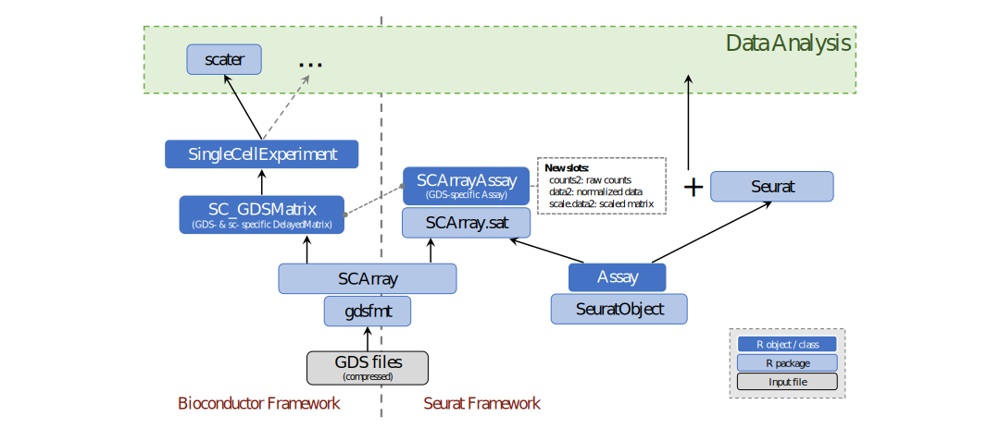
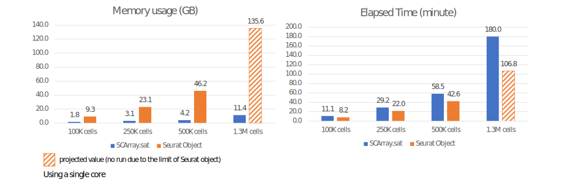

```{r echo=FALSE}
options(width=110)
```

## Introduction

Seurat is one of the most popular R packages for quality control, analysis, and exploration of single cell RNA sequencing data. However, its scalability is limited by the available memory. The SCArray.sat package extends the [Seurat](https://cran.r-project.org/package=Seurat) classes and functions to support [GDS files](http://www.bioconductor.org/packages/gdsfmt) as a DelayedArray backend for data representation. It introduces a new `SCArrayAssay` class (derived from the Seurat `Assay`), which wraps raw counts, normalized expressions and scaled data matrix based on [DelayedMatrix](http://www.bioconductor.org/packages/DelayedArray). It is designed to integrate seamlessly with the SeuratObject and Seurat packages to provide common data analysis, with the optimized algorithms for GDS data files.


~



~


The SeuratObject package defines the `Assay` class with three members/slots `counts`, `data` and `scale.data` storing raw counts, normalized expressions and scaled data matrix respectively. However, `counts` and `data` should be either a dense matrix or a sparse matrix defined in the [Matrix](https://cran.r-project.org/package=Matrix) package. The scalability of the sparse matrix is limited by the number of non-zero values (should be < 2^31), since the Matrix package uses 32-bit indices internally. `scale.data` in the `Assay` class is defined as a dense matrix, so it is also limited by the available memory. The new class `SCArrayAssay` is derived from `Assay`, with three additional slots `counts2`, `data2` and `scale.data2` replacing the old ones. These new slots can be DelayedMatrix wrapping an on-disk data matrix, without loading the data in memory.

The SCArray.sat package takes advantage of the S3 object-oriented methods defined in the SeuratObject and Seurat packages to reduce code redundancy, by implementing the functions specific to the classes `SCArrayAssay` and `SC_GDSMatrix` (GDS-specific DelayedMatrix). Table 1 shows a list of key S3 methods for data analysis. For example, the function `NormalizeData.SC_GDSMatrix()` will be called when a `SC_GDSMatrix` object is passed to the S3 generic `NormalizeData()`, while `NormalizeData.Assay()` and `NormalizeData.Seurat()` are unchanged. In addition, the SCArray and SCArray.sat packages implement the optimized algorithms for the calculations, by reducing the on-disk data access and taking the GDS data structure into account.

~

**Table 1: Key S3 methods implemented in the SCArray.sat package.**

| **Methods**               | **Description**           | **Note**                   |
|:--------------------------|:--------------------------|:---------------------------|
|NormalizeData.SC_GDSMatrix()        |Normalize raw count data | Store a DelayedMatrix  |
|ScaleData.SC_GDSMatrix()            |Scale and center the normalized data |    |
|FindVariableFeatures.SC_GDSMatrix() |Identifies features |     |
|RunPCA.SC_GDSMatrix()               |Run a PCA dimensionality reduction |       |

*SC_GDSMatrix: GDS- and single-cell- specific DelayedMatrix.*

~

~

## Examples

### 1. Small Datasets

```{r}
# Load the packages
suppressPackageStartupMessages({
    library(Seurat)
    library(SCArray)
    library(SCArray.sat)
})

# Input GDS file with raw counts
fn <- system.file("extdata", "example.gds", package="SCArray")

# show the file contents
(f <- scOpen(fn))
scClose(f)    # close the file


# Create a SCArrayAssay object from the GDS file
a <- scGetAssayGDS(fn)
class(a)    # new "SCArrayAssay", derived from Seurat Assay

# Create a Seurat object with the SCArrayAssay object
d <- CreateSeuratObject(a)

d <- NormalizeData(d)
d <- FindVariableFeatures(d, nfeatures=500)
d <- ScaleData(d)
```

**Let's check the internal data matrices,**
```{r}
# get the file name for the on-disk object
scGetFiles(d)

# raw counts
m <- GetAssayData(d, "counts")
scGetFiles(m)    # the file name storing raw count data
m

# normalized expression
# the normalized data does not save in neither the file nor the memory
GetAssayData(d, "data")

# scaled and centered data matrix
# in this case, the scaled data does not save in neither the file nor the memory
GetAssayData(d, "scale.data")
```

**Perform PCA and UMAP:**
```{r fig.align="center",fig.width=5,fig.height=3}
d <- RunPCA(d, ndims.print=1:2)
DimPlot(d, reduction="pca")

d <- RunUMAP(d, dims=1:50)    # use all PCs calculated by RunPCA()
DimPlot(d, reduction="umap")
```

~

### 2. Large Datasets

Let's download a large single-cell RNA-seq dataset from Bioconductor, and convert it to a GDS file. This step will take a while.

If the `TENxBrainData` package is not installed, run:
```R
# install a Bioconductor package
BiocManager::install("TENxBrainData")
```

Then,
```R
library(TENxBrainData)
library(SCArray)

# scRNA-seq data for 1.3 million brain cells from E18 mice (10X Genomics)
# the data will be downloaded automatically at the first time.
# raw count data is stored in HDF5 format
tenx <- TENxBrainData()
rownames(tenx) <- rowData(tenx)$Ensembl  # since rownames(tenx)=NULL

# save it to a GDS file
SCArray::scConvGDS(tenx, "1M_sc_neurons.gds")
```
After the file conversion, users can use this GDS file with Seurat to analyze the data.

~

~

## Benchmarks

### 1. Test Datasets

**Table 2: Datasets in the benchmarks.**

| **Dataset**  | **# of features**  | **# of cells**  | **GDS file**  | **RDS (Seurat Object)**  |
|:-------------|:-------------------|:----------------|:--------------|:-------------------------|
|D100   |27,998  | 100K        | 209MB  | 419MB  |
|D250   |27,998  | 250K        | 529MB  | 1.1GB  |
|D500   |27,998  | 500K        | 1.1GB  | 2.2GB  |
|Dfull  |27,998  | 1.3 million | 2.8GB  | Out of the limit of sparse matrix |

*# of non-zeros should be < 2^31 in a sparse matrix.*

~

### 2. R Codes in the Benchmark

The following R script is used in the benchmark for testing GDS files, and the R codes for testing the Seurat Object are similar except the input file.
```R
suppressPackageStartupMessages({
    library(Seurat)
    library(SCArray.sat)
})

fn <- "1M_sc_neurons_n100.gds"
x <- SCArray.sat::scGetAssayGDS(fn)
class(x)    # new "SCArrayAssay"

d <- Seurat::CreateSeuratObject(x)

d <- NormalizeData(d)
d <- FindVariableFeatures(d, nfeatures=2000)
d <- ScaleData(d)

d <- RunPCA(d)
d <- RunUMAP(d, dims=1:50)

saveRDS(d, "test_n100_sat.rds")

q('no')
```

~

### 3. Memory Usage and Elapsed Time

With large test datasets, the SCArray.sat package significantly reduces the memory usages compared with the Seurat package, while the in-memory implementation in Seurat is only 2 times faster than SCArray.sat. When the full dataset "Dfull" was tested, Seurat failed to load the data since the number of non-zeros is out of the limit of sparse matrix.



~

~

## Miscellaneous

### Downgrade SCArrayAssay

The `SCArrayAssay` object can be downgraded to the regular `Assay`. It is useful when the downstream functions or packages do not support DelayedArray. 

```{r}
is(GetAssay(d))

new_d <- scMemory(d)  # downgrade the active assay
is(GetAssay(new_d))

is(GetAssayData(d, "scale.data"))  # it is a DelayedMatrix

new_d <- scMemory(d, slot="scale.data")  # downgrade "scale.data" in the active assay
is(GetAssay(new_d))  # it is still SCArrayAssay
is(GetAssayData(new_d, "scale.data"))  # in-memory matrix
```

~

### Debugging

`options(SCArray.verbose=TRUE)` can be used to enable displaying debug information in the SCArray and SCArray.sat packages. For example,

```{r}
options(SCArray.verbose=TRUE)

d <- ScaleData(d)
```

~

~

## Session Information

```{r}
# print version information about R, the OS and attached or loaded packages
sessionInfo()
```
